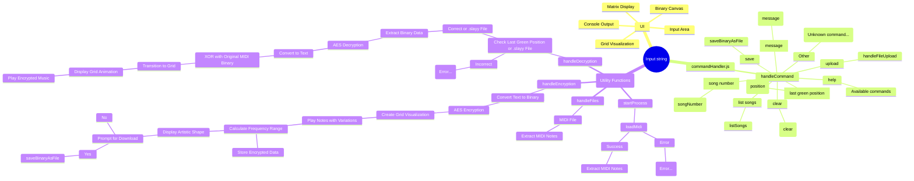

# GSL Encryption Project

## Overview
The GSL Encryption Project is a web-based application designed to provide robust encryption and decryption functionalities, along with an interactive user interface for various cryptographic tasks. This project leverages modern web technologies and integrates music selection features to enhance user experience.
All current and intended (in privately used repos for now and not published on Gas-Lighting.com -- based on a order of clicking the letters to progress to the vercel app intergration via all the sources below:
<p align="center">
    
    
    
    
    
    
    
    
    
    
    
    
    
    
    
    
    
    
    
    
    
    
    
</p>


## Features
- **Text Encryption and Decryption**: Encrypt and decrypt text input using advanced algorithms.
- **File Encryption**: Encrypt files uploaded by the user.
- **Interactive Canvas**: Visualize binary data on an HTML5 canvas.
- **Song Selection**: Choose from a list of songs to play during encryption/decryption processes.
- **Responsive Design**: User-friendly interface adaptable to various devices.

## Technologies Used
# GSL Encryption Project

## Overview
The GSL Encryption Project is a web-based application designed to provide robust encryption and decryption functionalities, along with an interactive user interface for various cryptographic tasks. This project leverages modern web technologies and integrates music selection features to enhance user experience.

## Features
- **Text Encryption and Decryption**: Encrypt and decrypt text input using advanced algorithms.
- **File Encryption**: Encrypt files uploaded by the user.
- **Interactive Canvas**: Visualize binary data on an HTML5 canvas.
- **Song Selection**: Choose from a list of songs to play during encryption/decryption processes.
- **Responsive Design**: User-friendly interface adaptable to various devices.

## Installation
1. **Clone the Repository**:
   ```
   git clone https://github.com/musha1140/midi.git
   cd GSL-Encryption
   GSL-Encryption/
   ```


**No additional dependencies are required beyond the included libraries at the top, which are irrelevent to the repo as it is using cdns.**
(due to the static nature that is in this current repo)**


```
project-root/
│
├── public/
│   ├── index.html
│   ├── style.css
│
├── src/
│   ├── commandHandler.js
│   ├── logic.js
│
├── index.js
├── tailwind.config.js
├── postcss.config.js
├── package.json
├── package-lock.json
```
## Viewing Mermaid Diagram
To view the following logic portrayed in Mermaid , you can use the Mermaid Live Editor. Follow these steps:

1. Go to the [Mermaid Live Editor](https://mermaid-js.github.io/mermaid-live-editor/).
2. Copy the Mermaid diagram code below.
3. Paste the code into the Mermaid Live Editor.
4. The editor will render the diagram, allowing you to visualize the project structure and terminal logic.
```

```
Diagram for Terminal Logic

### Explanation of Logic:

1. **File Structure**:
   - **index.html**: The main HTML file.
   - **style.css**: Custom styles.
   - **logic.js**: Main JavaScript logic.
   - **README.md**: Project readme.
   - **assets/**: Directory for assets (images, audio files, etc.).
   - **libs/**: Directory for external libraries (jQuery, Tone.js, Midi.js).

2. **Terminal Logic**:
   - **Console**: The terminal console where user interacts.
   - **Welcome Message**: Initial message displayed to the user.
   - **User Input**: Captures input from the user.
   - **Command**: Determines the action based on user input.
     - **help**: Shows a help message.
     - **clear**: Clears the console.
     - **list songs**: Lists available songs.
     - **play <song_number>**: Plays the specified song.
     - **encrypt <message>**: Encrypts the user-provided message.
     - **decrypt**: Decrypts the message.
     - **upload**: Handles file upload for decryption.
   - **Encrypt Message Flow**:
     - Convert the message to binary.
     - XOR with ECC.
     - Visualize the resulting grid.
   - **Decrypt Message Flow**:
     - Convert binary back to message.
   - **File Upload**:
     - Handles the upload and processing of .slayy files for decryption.
   - **Play Song**:
     - Fetches the MIDI file.
     - Parses the MIDI file.
     - Plays the MIDI file.
     - Updates the gameboard visualization.

       
**Static (for future) as it stands incomplete right now:**
```
GSL-Encryption/
│
├── index.html          # Main HTML file
├── style.css           # Custom styles
├── logic.js            # Main JavaScript logic
├── README.md           # Project readme
│
├── assets/             # Directory for assets (images, audio files, etc.)
│   ├── song1.mid - ToneJS Midi
│   ├── song2.wav - FFT + Recompile to "simulate midi"
│   └── song3.mp3 - FFT + Using mathJS and reverse engineering the binary files (neondb, mongodb via replit's sql)
│
└── libs/               # Directory for external libraries
    ├── jquery.min.js
    ├── tone.min.js
    └── midi.min.js
```
Please use the intended design to create a more polished version, or to use the idea to help better your own idea.

